# Introduction to Stan

Stan is a program which allows us to run MCMC, as well as other Bayesian Statistical Methods. Stan utilizes the No-U-Turn Sampler (NUTS), which is a variant of Hamiltonian Monte Carlo Simulation approach. Stan is often better than R based simulation methods as it is written in C++, so it is very fast. 

Programs such as WinBUGS, JAGS, and OpenBUGS primarily use the Gibbs sampler which is beneficial as it does not require tuning parameters, but do these approaches do not handle user defined distributions well or sample well from posterior distributions with correlated parameters. These difficulties also hold when using the Metropolis-Hastings Algorithm. 

The aforementioned NUTS method and other alternatives such as the MCMC-DE (*Turner et al,2013*) do handle the short comings of Gibbs Sampling and the MH algorithm. We choose NUTS over MCMC-DE as it requires less precision in tuning, as NUTS does not require tuning parameters. 


Stan is a Bayesian modeling program which is implemented by defining likelihood and priors to sample from posterior distributions.

Stan supports the following variable types:
  -integer
  -Real numbers
  -Vectors
  -matricies

Stan processes instructions sequentially and allows users to utilize standard control flow elements, such as **for** and **while**. We may also use conditionals such as **if-then** and **if-then-else**. 

## Example 1: Built-in Exponential

We wish to model the following:
$$
\begin{aligned}
y & \sim Exponential(\lambda) \\
\lambda & \sim Gamma(\alpha,\beta) \\
\alpha & = 1\\
\beta & = 1
\end{aligned}
$$


```r
# Clear the workspace so we don't get any conflicts
rm(list=ls())

# Install rstan. This step assumes you've followed the toolchain install for stan
if(!require("rstan")){install.packages("rstan", dependencies = TRUE, type = "source")}
library("rstan")

# Prevent rerunning previously compiled code
rstan_options(auto_write = TRUE)

# Enable multicore parallel processing for chains in the rstan package
options(mc.cores=parallel::detectCores())

# Overwrite rstan files before re-running code
rstan_options(auto_write = TRUE)

# Install the parallel package for running multiple chains at once
# links rstan in the parallel via Rstudio
if(!require("rstudioapi")){install.packages("rstudioapi", dependencies = TRUE, type = "source")}
library("rstudioapi")

# This package allows us to compute in parallel, which is very useful in mcmc
if(!require("parallel")){install.packages("parallel", dependencies = TRUE, type = "source")}
```

```
## Loading required package: parallel
```

```r
library("parallel")


# Set the seed for generation for replicability 
set.seed(1775)

# Write the stan model in a single R Character String.
model_string <- ("
data{
  int LENGTH;
  vector[LENGTH] Y;
}

parameters{
  real<lower=0> lambda;
}

model{
  real alpha;
  real beta;
  alpha  = 1.0;
  beta   = 1.0;
  lambda ~ gamma(alpha,beta);
  Y ~ exponential(lambda);
}

generated quantities{
  real pred;
  pred = exponential_rng(lambda);
}
")

# Prepare the simulation data to run out parameter recovery test
# Set the lambda parameter to 1
lambda_param <- 1

# Generate our random sample from the exponential distribution
exp_sample <- rexp(500,lambda_param)

# Create a variable for length to pass into our Stan model
len <- length(exp_sample)

# Run the Stan model 
stan_fit <- rstan::stan(model_code = model_string, #Character string that contains the Stan model
                        data       = list(Y = exp_sample, LENGTH = len),
                        warmup     = 750,  # Burn-in 750 iterations before extracting information
                        iter       = 1500, # Run at most 1500 iterations unless convergence is reached sooner
                        chains     = 3, #Run 3 Markov chains
                        cores      = getOption("mc.cores", 1L) # Get the cores we set earlier for parallelization
                        )
```

```
## In file included from C:/Users/Admin/Documents/R/win-library/3.5/BH/include/boost/config.hpp:39:0,
##                  from C:/Users/Admin/Documents/R/win-library/3.5/BH/include/boost/math/tools/config.hpp:13,
##                  from C:/Users/Admin/Documents/R/win-library/3.5/StanHeaders/include/stan/math/rev/core/var.hpp:7,
##                  from C:/Users/Admin/Documents/R/win-library/3.5/StanHeaders/include/stan/math/rev/core/gevv_vvv_vari.hpp:5,
##                  from C:/Users/Admin/Documents/R/win-library/3.5/StanHeaders/include/stan/math/rev/core.hpp:12,
##                  from C:/Users/Admin/Documents/R/win-library/3.5/StanHeaders/include/stan/math/rev/mat.hpp:4,
##                  from C:/Users/Admin/Documents/R/win-library/3.5/StanHeaders/include/stan/math.hpp:4,
##                  from C:/Users/Admin/Documents/R/win-library/3.5/StanHeaders/include/src/stan/model/model_header.hpp:4,
##                  from file2b404b23c36.cpp:8:
## C:/Users/Admin/Documents/R/win-library/3.5/BH/include/boost/config/compiler/gcc.hpp:186:0: warning: "BOOST_NO_CXX11_RVALUE_REFERENCES" redefined
##  #  define BOOST_NO_CXX11_RVALUE_REFERENCES
##  ^
## <command-line>:0:0: note: this is the location of the previous definition
## In file included from C:/Users/Admin/Documents/R/win-library/3.5/StanHeaders/include/stan/math/rev/core.hpp:44:0,
##                  from C:/Users/Admin/Documents/R/win-library/3.5/StanHeaders/include/stan/math/rev/mat.hpp:4,
##                  from C:/Users/Admin/Documents/R/win-library/3.5/StanHeaders/include/stan/math.hpp:4,
##                  from C:/Users/Admin/Documents/R/win-library/3.5/StanHeaders/include/src/stan/model/model_header.hpp:4,
##                  from file2b404b23c36.cpp:8:
## C:/Users/Admin/Documents/R/win-library/3.5/StanHeaders/include/stan/math/rev/core/set_zero_all_adjoints.hpp:14:17: warning: 'void stan::math::set_zero_all_adjoints()' defined but not used [-Wunused-function]
##      static void set_zero_all_adjoints() {
##                  ^
```

```r
# Get a summary of the model output from Stan
print(stan_fit)
```

```
## Inference for Stan model: 27239cc544ecb096bd3151820bc9fa84.
## 3 chains, each with iter=1500; warmup=750; thin=1; 
## post-warmup draws per chain=750, total post-warmup draws=2250.
## 
##           mean se_mean   sd    2.5%     25%     50%     75%   97.5% n_eff
## lambda    1.13    0.00 0.05    1.03    1.10    1.13    1.17    1.24   842
## pred      0.90    0.02 0.92    0.02    0.25    0.63    1.22    3.38  2250
## lp__   -440.08    0.03 0.73 -442.29 -440.25 -439.78 -439.61 -439.55   841
##        Rhat
## lambda    1
## pred      1
## lp__      1
## 
## Samples were drawn using NUTS(diag_e) at Thu Oct 11 15:00:03 2018.
## For each parameter, n_eff is a crude measure of effective sample size,
## and Rhat is the potential scale reduction factor on split chains (at 
## convergence, Rhat=1).
```

```r
# Perform posterior predictions
mcmc_chain <- as.matrix(stan_fit)

# Create an auto correlation plot
acf(mcmc_chain[,'lambda'])
```

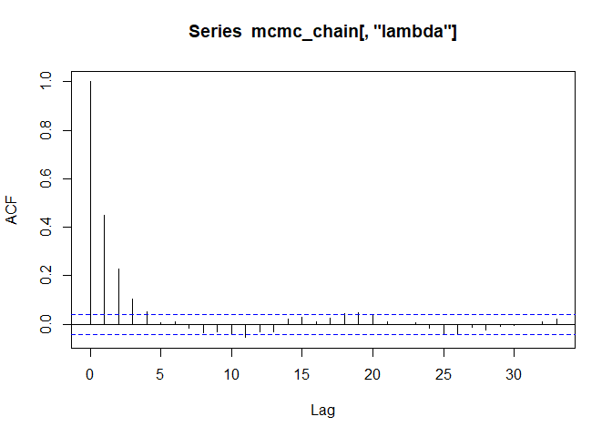<!-- -->

```r
# Create a samples vs iteration plot
stan_trace(stan_fit)
```

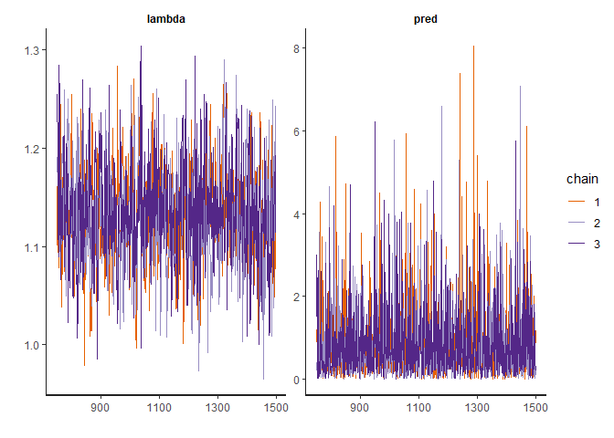<!-- -->

```r
# Posterior preditions
# The solid density line is the posterior predictive density.
pred <- mcmc_chain[,'pred']
hist(exp_sample, probability = TRUE);lines(density(pred))
```

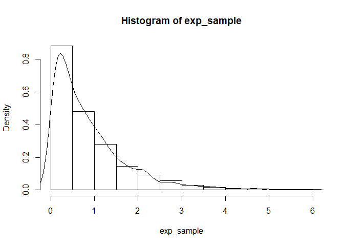<!-- -->

```r
# Posterior distribution of lambda
plot(density(mcmc_chain[,'lambda']))
```

<!-- -->


## Example 2: Explicit Exponential

Here we wish the run the same model as *Example 1* but choose to implement the exponential distribution as a user defined function using the likelihood and prior distribution.


```r
# Clear the workspace so we don't get any conflicts
rm(list=ls())

# Install the rstan package
if(!require("rstan")){install.packages("rstan", dependencies = TRUE, type = "source")}
library("rstan")

# Prevent rerunning previously compiled code
rstan_options(auto_write = TRUE)
# Enable multicore parallel processing for chains in the rstan package
options(mc.cores=parallel::detectCores())
rstan_options(auto_write = TRUE)

# Install the parallel package for running multiple chains at once
# links rstan in the parallel via Rstudio
if(!require("rstudioapi")){install.packages("rstudioapi", dependencies = TRUE, type = "source")}
library("rstudioapi")

if(!require("parallel")){install.packages("parallel", dependencies = TRUE, type = "source")}
library("parallel")

# Set the seed for generation for replicability 
set.seed(1775)

# Write the stan model in a single R Character String.
custom_model <- ('

    functions{
      real newexp_log(vector x, real lam){
        vector[num_elements(x)] prob;
        real lprob;
        for (i in 1:num_elements(x)){
          prob[i] = lam*exp(-lam*x[i]);
        }
        lprob = sum(log(prob));
        return lprob;
      }
    }
    
    data{
      int LENGTH;
      vector[LENGTH] Y;
    }
    
    parameters{
      real<lower=0> lambda;
    }
    
    model{
      real alpha;
      real beta;
      alpha = 1.0;
      beta = 1.0;
      lambda ~ gamma(alpha,beta);
      Y ~ newexp(lambda);
    }
    
    generated quantities{
      real pred;
      pred = exponential_rng(lambda);
    }

    ')

# Prepare the simulation data to run out parameter recovery test
# Set the lambda parameter to 1
lambda_param <- 1

# Generate our random sample from the exponential distribution
exp_sample <- rexp(500,lambda_param)

# Create a variable for length to pass into our Stan model
len <- length(exp_sample)

# Run the Stan model 
system.time(
stan_fit <- rstan::stan(model_code = custom_model, #Character string that contains the Stan model
                        data       = list(Y = exp_sample, LENGTH = len),
                        warmup     = 750,  # Burn-in 750 iterations before extracting information
                        iter       = 1500, # Run at most 1500 iterations unless convergence is reached sooner
                        chains     = 3, #Run 3 Markov chains
                        cores      = getOption("mc.cores", 1L)
                        
                        ))
```

```
## In file included from C:/Users/Admin/Documents/R/win-library/3.5/BH/include/boost/config.hpp:39:0,
##                  from C:/Users/Admin/Documents/R/win-library/3.5/BH/include/boost/math/tools/config.hpp:13,
##                  from C:/Users/Admin/Documents/R/win-library/3.5/StanHeaders/include/stan/math/rev/core/var.hpp:7,
##                  from C:/Users/Admin/Documents/R/win-library/3.5/StanHeaders/include/stan/math/rev/core/gevv_vvv_vari.hpp:5,
##                  from C:/Users/Admin/Documents/R/win-library/3.5/StanHeaders/include/stan/math/rev/core.hpp:12,
##                  from C:/Users/Admin/Documents/R/win-library/3.5/StanHeaders/include/stan/math/rev/mat.hpp:4,
##                  from C:/Users/Admin/Documents/R/win-library/3.5/StanHeaders/include/stan/math.hpp:4,
##                  from C:/Users/Admin/Documents/R/win-library/3.5/StanHeaders/include/src/stan/model/model_header.hpp:4,
##                  from file2b40627826f0.cpp:8:
## C:/Users/Admin/Documents/R/win-library/3.5/BH/include/boost/config/compiler/gcc.hpp:186:0: warning: "BOOST_NO_CXX11_RVALUE_REFERENCES" redefined
##  #  define BOOST_NO_CXX11_RVALUE_REFERENCES
##  ^
## <command-line>:0:0: note: this is the location of the previous definition
## In file included from C:/Users/Admin/Documents/R/win-library/3.5/StanHeaders/include/stan/math/rev/core.hpp:44:0,
##                  from C:/Users/Admin/Documents/R/win-library/3.5/StanHeaders/include/stan/math/rev/mat.hpp:4,
##                  from C:/Users/Admin/Documents/R/win-library/3.5/StanHeaders/include/stan/math.hpp:4,
##                  from C:/Users/Admin/Documents/R/win-library/3.5/StanHeaders/include/src/stan/model/model_header.hpp:4,
##                  from file2b40627826f0.cpp:8:
## C:/Users/Admin/Documents/R/win-library/3.5/StanHeaders/include/stan/math/rev/core/set_zero_all_adjoints.hpp:14:17: warning: 'void stan::math::set_zero_all_adjoints()' defined but not used [-Wunused-function]
##      static void set_zero_all_adjoints() {
##                  ^
```

```
##    user  system elapsed 
##    1.04    0.33   53.08
```

```r
# Get a summary of the model output from Stan
print(stan_fit)
```

```
## Inference for Stan model: 1760631832b6c80dbdd4b7d64055380d.
## 3 chains, each with iter=1500; warmup=750; thin=1; 
## post-warmup draws per chain=750, total post-warmup draws=2250.
## 
##           mean se_mean   sd    2.5%     25%     50%     75%   97.5% n_eff
## lambda    1.13    0.00 0.05    1.03    1.10    1.13    1.16    1.23   859
## pred      0.87    0.02 0.86    0.02    0.26    0.60    1.20    3.28  2250
## lp__   -440.03    0.02 0.69 -441.97 -440.17 -439.77 -439.60 -439.55  1090
##        Rhat
## lambda    1
## pred      1
## lp__      1
## 
## Samples were drawn using NUTS(diag_e) at Thu Oct 11 15:00:59 2018.
## For each parameter, n_eff is a crude measure of effective sample size,
## and Rhat is the potential scale reduction factor on split chains (at 
## convergence, Rhat=1).
```

```r
# Perform posterior predictions
mcmc_chain <- as.matrix(stan_fit)

# Create an auto correlation plot
acf(mcmc_chain[,'lambda'])
```

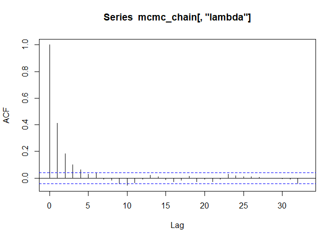<!-- -->

```r
# Create a samples vs iteration plot
traceplot(stan_fit)
```

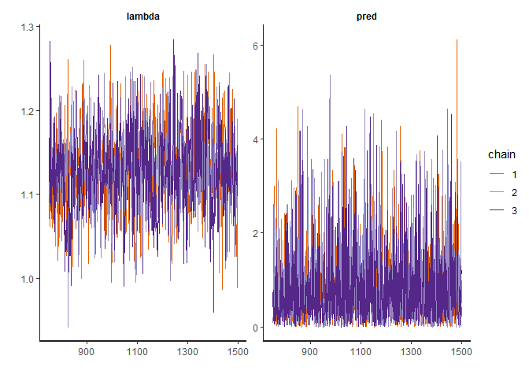<!-- -->

```r
# Posterior preditions
# The solid density line is the posterior predictive density.
pred <- mcmc_chain[,'pred']
hist(exp_sample, probability = TRUE);lines(density(pred))
```

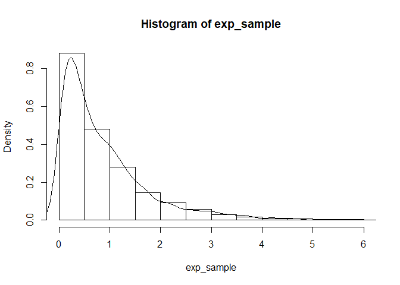<!-- -->

```r
# Posterior distribution of lambda
plot(density(mcmc_chain[,'lambda']))
```

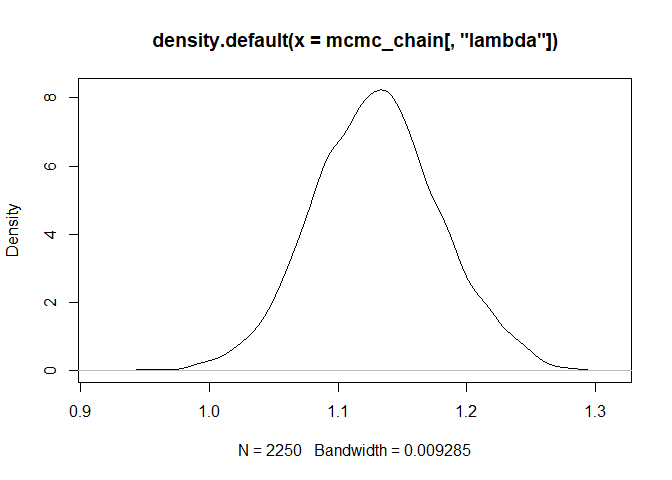<!-- -->


```r
options(tidyverse.width = 80)
# Install the rstan package
if(!require("rstan")){install.packages("rstan", dependencies = TRUE, type = "source")}
library("rstan")

# Prevent rerunning previously compiled code
rstan_options(auto_write = TRUE)
# Enable multicore parallel processing for chains in the rstan package
options(mc.cores=parallel::detectCores())

# Install the parallel package for running multiple chains at once
# links rstan in the parallel via Rstudio
if(!require("rstudioapi")){install.packages("rstudioapi", dependencies = TRUE, type = "source")}
library("rstudioapi")

if(!require("parallel")){install.packages("parallel", dependencies = TRUE, type = "source")}
library("parallel")

if(!require("ggmcmc")){install.packages("ggmcmc", dependencies = TRUE, type = "source")}
library("ggmcmc")

suppressPackageStartupMessages(suppressWarnings(library("tidyverse", quietly = TRUE)))
library("tidyverse")
```


```r
# Set the seed for generation for replicability 
set.seed(1775)

# Generate the observed data 
y <- rnorm(100,mean = 0, sd=1)

# compute the MLE for the data
y_bar <- mean(y)
y_bar
```

```
## [1] 0.07309292
```

```r
# Write the stan model in a single R Character String.
custom_model <- ('

    functions {
  // Define the non-normalized log probability density function
  // Takes real values for y, mu, and sigma.
  real newnormal_lpdf(real y, real mu, real sigma) {
    return -log(2 * pi()) / 2 - log(sigma) 
           - square(mu - y) / (2 * sigma^2);
    }
  }
    data {
      // The number of y values in the observed data
      int N;
      // A real vector of the data passed in during the call to rstan
      real y[N];
      // Initialize sigma as a real value
      real<lower=0> sigma;
          }
    parameters {
      real mu;
    }
  
    model {
      // Prior distribution
      mu ~ normal(0, 10^6);

      // Likelihood
      for(n in 1:N){
        // outcome y[n], with parameters mu and sigma;
        target +=  newnormal_lpdf(y[n] | mu, sigma);
        }
    }
    ')

# Run the Stan model 
system.time(
stan_fit <- rstan::stan(model_code = custom_model, #Character string that contains the Stan model
                        data       = list(y = y, N = length(y), sigma = 1),
                        warmup     = 750,  # Burn-in 750 iterations before extracting information
                        iter       = 1500, # Run at most 1500 iterations unless convergence is reached sooner
                        chains     = 3, #Run 3 Markov chains
                        cores      = getOption("mc.cores", 1L),
                        seed = 1775
                        
                        ))
```

```
## In file included from C:/Users/Admin/Documents/R/win-library/3.5/BH/include/boost/config.hpp:39:0,
##                  from C:/Users/Admin/Documents/R/win-library/3.5/BH/include/boost/math/tools/config.hpp:13,
##                  from C:/Users/Admin/Documents/R/win-library/3.5/StanHeaders/include/stan/math/rev/core/var.hpp:7,
##                  from C:/Users/Admin/Documents/R/win-library/3.5/StanHeaders/include/stan/math/rev/core/gevv_vvv_vari.hpp:5,
##                  from C:/Users/Admin/Documents/R/win-library/3.5/StanHeaders/include/stan/math/rev/core.hpp:12,
##                  from C:/Users/Admin/Documents/R/win-library/3.5/StanHeaders/include/stan/math/rev/mat.hpp:4,
##                  from C:/Users/Admin/Documents/R/win-library/3.5/StanHeaders/include/stan/math.hpp:4,
##                  from C:/Users/Admin/Documents/R/win-library/3.5/StanHeaders/include/src/stan/model/model_header.hpp:4,
##                  from file2b406ffd7de7.cpp:8:
## C:/Users/Admin/Documents/R/win-library/3.5/BH/include/boost/config/compiler/gcc.hpp:186:0: warning: "BOOST_NO_CXX11_RVALUE_REFERENCES" redefined
##  #  define BOOST_NO_CXX11_RVALUE_REFERENCES
##  ^
## <command-line>:0:0: note: this is the location of the previous definition
## In file included from C:/Users/Admin/Documents/R/win-library/3.5/StanHeaders/include/stan/math/rev/core.hpp:44:0,
##                  from C:/Users/Admin/Documents/R/win-library/3.5/StanHeaders/include/stan/math/rev/mat.hpp:4,
##                  from C:/Users/Admin/Documents/R/win-library/3.5/StanHeaders/include/stan/math.hpp:4,
##                  from C:/Users/Admin/Documents/R/win-library/3.5/StanHeaders/include/src/stan/model/model_header.hpp:4,
##                  from file2b406ffd7de7.cpp:8:
## C:/Users/Admin/Documents/R/win-library/3.5/StanHeaders/include/stan/math/rev/core/set_zero_all_adjoints.hpp:14:17: warning: 'void stan::math::set_zero_all_adjoints()' defined but not used [-Wunused-function]
##      static void set_zero_all_adjoints() {
##                  ^
```

```
##    user  system elapsed 
##    0.67    0.39   52.28
```

```r
# Get a summary of the model output from Stan
print(stan_fit)
```

```
## Inference for Stan model: aec37a3d2664f1ebafb6aeb892cb7ccf.
## 3 chains, each with iter=1500; warmup=750; thin=1; 
## post-warmup draws per chain=750, total post-warmup draws=2250.
## 
##         mean se_mean   sd    2.5%     25%     50%     75%   97.5% n_eff
## mu      0.07    0.00 0.10   -0.13    0.01    0.07    0.14    0.27   937
## lp__ -142.23    0.02 0.72 -144.25 -142.41 -141.95 -141.78 -141.74  1195
##      Rhat
## mu      1
## lp__    1
## 
## Samples were drawn using NUTS(diag_e) at Thu Oct 11 15:01:53 2018.
## For each parameter, n_eff is a crude measure of effective sample size,
## and Rhat is the potential scale reduction factor on split chains (at 
## convergence, Rhat=1).
```

```r
# Perform posterior predictions
mcmc_chain <- as.matrix(stan_fit)

# Create an auto correlation plot
acf(mcmc_chain[,'mu'])
```

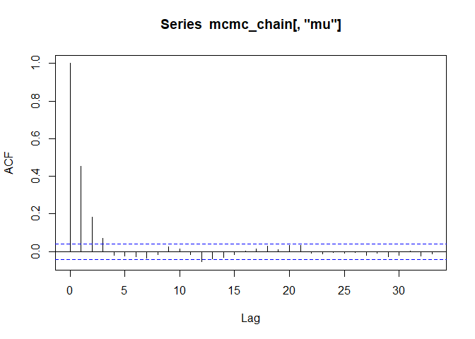<!-- -->

```r
# Create a samples vs iteration plot
traceplot(stan_fit)
```

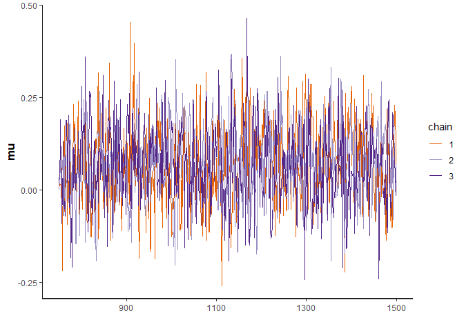<!-- -->

```r
# Posterior preditions
# The solid density line is the posterior predictive density.
pred <- mcmc_chain[,'mu']
hist(y, probability = TRUE);lines(density(pred))
```

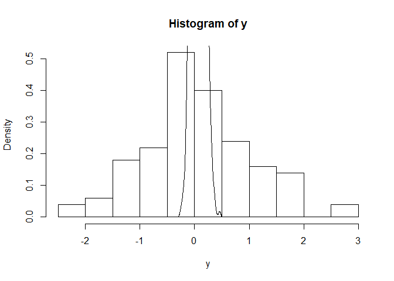<!-- -->

```r
# Posterior distribution of lambda
plot(density(mcmc_chain[,'mu']))
```

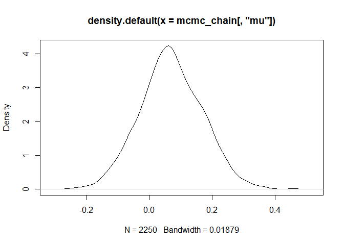<!-- -->

<!-- Example 3 Wu's model for burn data: -->

